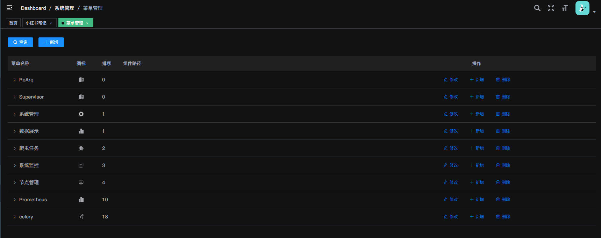
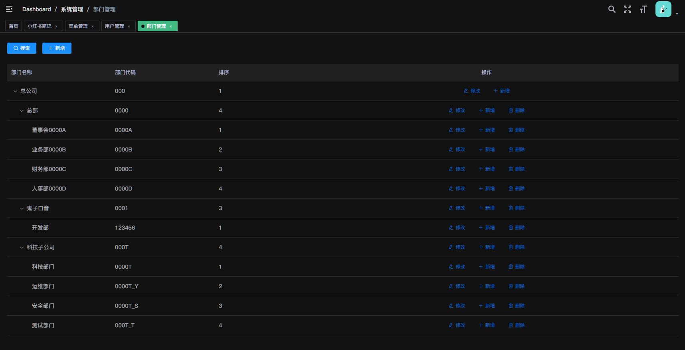
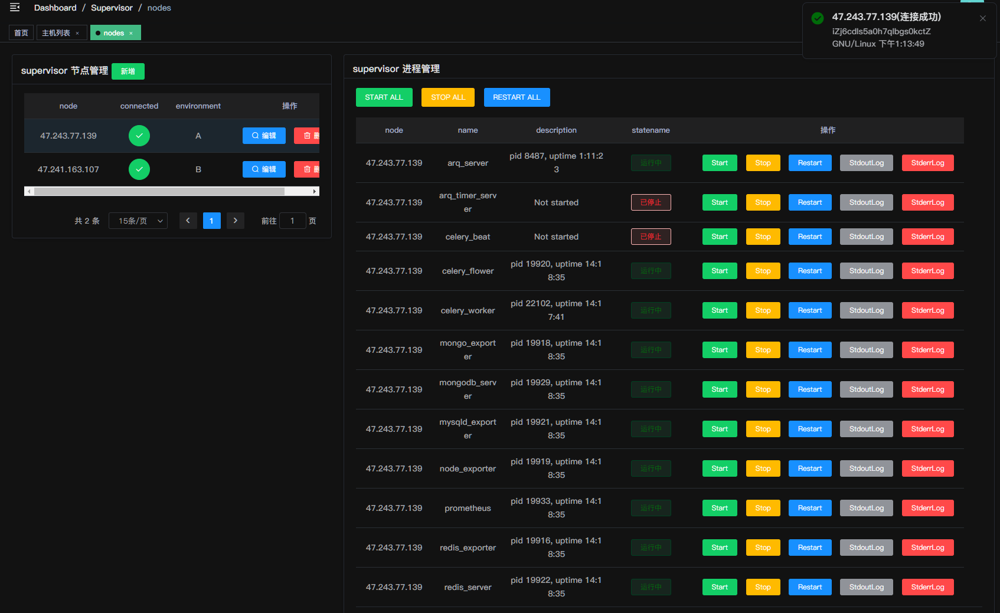
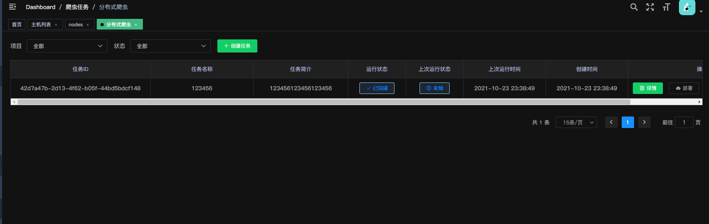
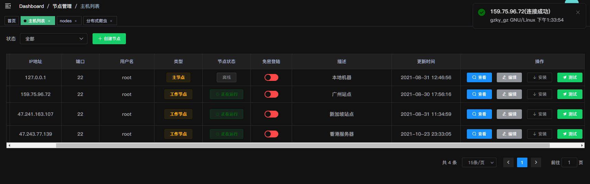
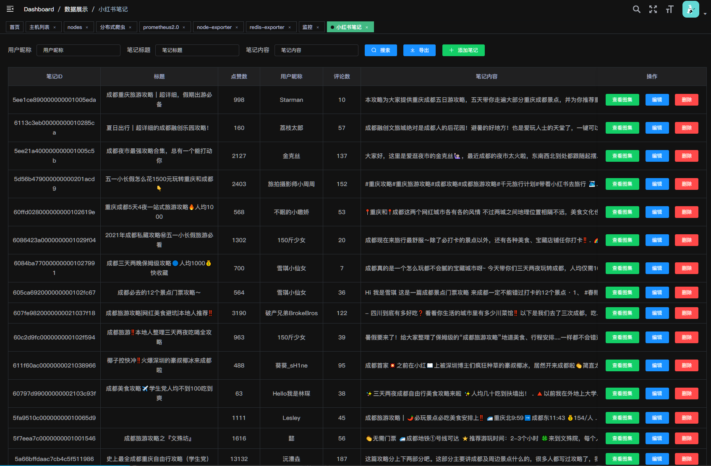
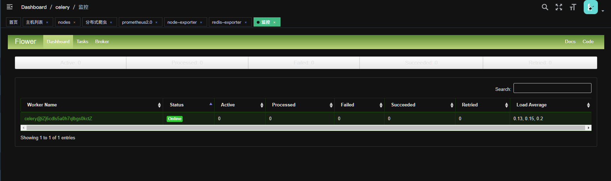
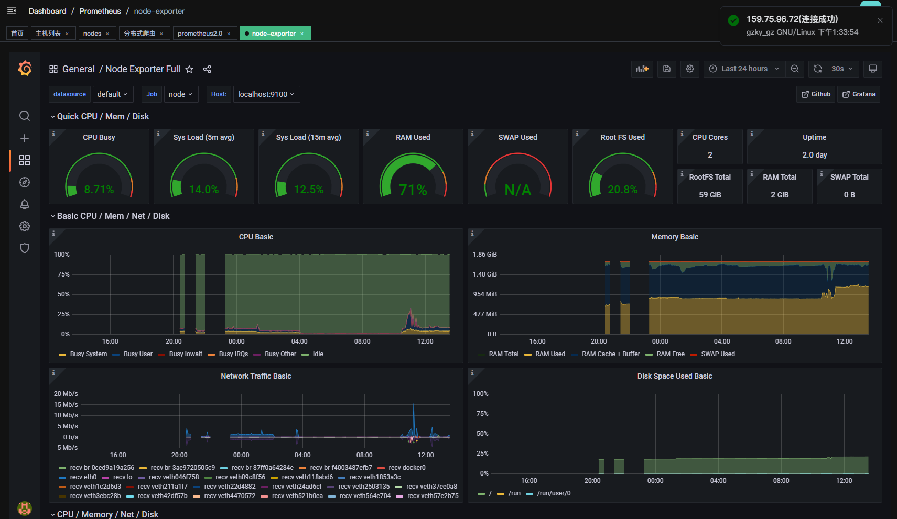
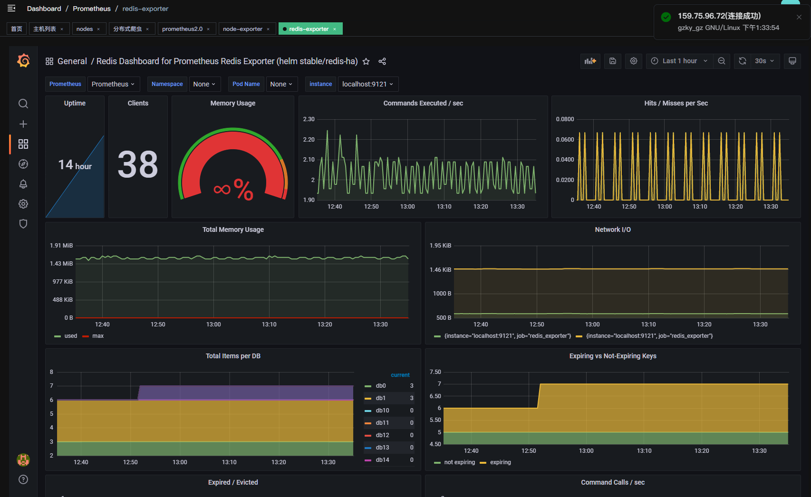

# Tprogram

## 集成功能

- [x] 登录/注销
- [X] 用户权限管理
- [x] 数据展示
- [x] 爬虫任务
- [x] 远程批量部署和调度
- [x] 新增节点、测试节点
- [X] 节点管理
- [ ] `WebSocket` 任务日志、节点日志
- [X] `Prometheus`
- [X] `Celery`
- [ ] `Arq`
- [X] `Docker`
- [X] `Supervisor`
- [ ] `Docker`

## 预览
### http://47.243.77.139

`username:test123`

`password:test123`

---

### 用户权限

---

### Sup 管理

---

### Crawl 管理

---

### Hosts 管理

---

### 数据展示

---

### Celery 监控

---

### 普罗米修斯监控

